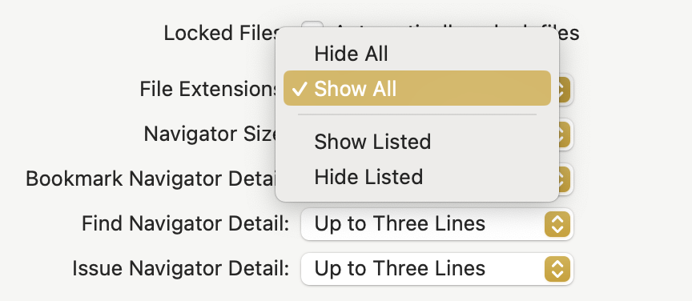

Xcode는 버전에 따라서 설정 항목들이 미묘하게 달라지곤 하는데, 이번에는 파일 확장자를 표시하는 방법을 기록해두려고 한다.

대부분의 설정들은 [Xcode]-[Settings]-[General] 에서 조절할 수 있고, 확장자 표시를 위해서는 그 중에 [File Extensions] 에서 선택할 수 있다.

모두 표시하거나 숨길 수 있고, 또 지정한 확장자만 표시하거나 숨길 수 있다.

아래와 같이 *Show All* 을 선택한 경우에는 Xcode 의 내비게이션에서 파일의 확장자가 표시되는 것을 확인할 수 있다.

